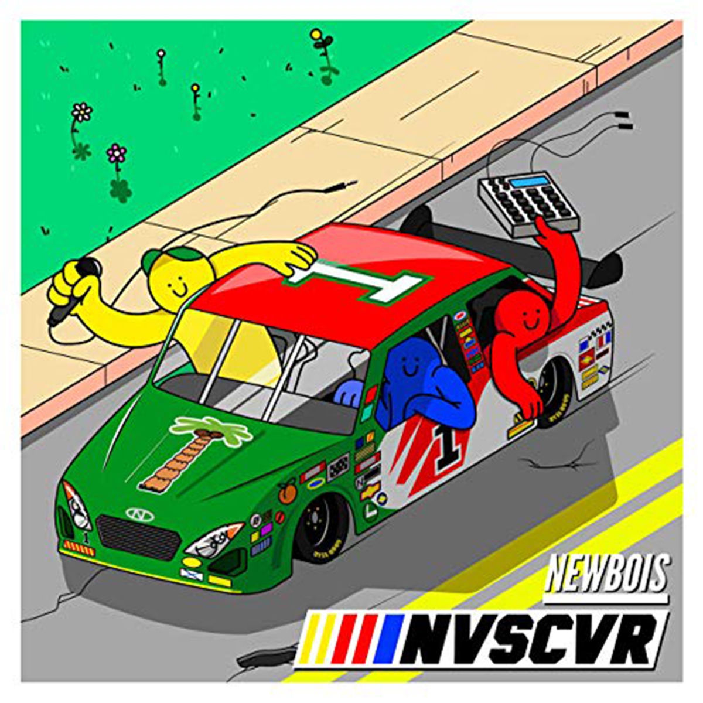

Solemne-02

## Integrantes del grupo

- (Iñaki Aristia) [cuentaGithub](https://github.com/inakiariztia)
- (Colomba Icaran) [cuentaGithub](https://github.com/colombaicaran-design)
## Descripción del disco



- (NewBois)
- 2021
- NVSCVR
- Tracklist

```txt
1. Intro

2. NVSCVR

3. Porsche

4. Jordan 1

5. Trap de Verdad

6. Mal Necesario

7. No Toy En Esa

8. Bye ByeCancion 1
```

- Aspecto del álbum a desarrollar (premisa)

> El proyecto consiste en una abstracción interactiva basada en el universo visual del álbum NVSCVR de Newbois. Se busca recrear la estética urbana de alta velocidad y estilo cómic de la portada mediante una pista de carreras central rodeada de vegetación animada (flores en movimiento continuo) que simula el avance veloz del coche en el eje Y. Sobre el vehículo se posicionaron los tres personajes geométricos que representan a los miembros de la banda (en colores Amarillo, Azul y Rojo) ejecutando un balanceo rítmico. El usuario tiene control directo sobre la posición lateral del auto al presionar el mouse, lo que le permite "conducir" el coche dentro de márgenes preestablecidos por el asfalto.

## Conclusión del proceso

- Distancia entre premisa y resultado

> El resultado cumple fielmente con la premisa interactiva. Al separar el programa en funciones dedicadas (dibujarPista, dibujarAuto, dibujarFlores), se logró una composición escalable y ordenada donde la velocidad de la pista, el rebote sincopado de los personajes y el control del cursor interactúan sin generar sobrecarga visual ni bugs de desalineación.
>
> Lorm ipsum párrafo 2

- Cosas no conseguidas

> Me habría gustado que el número 90 grados impreso sobre el capó del auto cambiara dinámicamente de cifra según la puntuación de tiempo transcurrido, agregando mecánicas más cercanas a un videojuego clásico de carreras.

- Descubrimientos al trabajar

> El mayor descubrimiento fue el uso de la modularización para mantener un entorno de renderizado limpio. Aislar el número "1" rotado con HALF_PI dentro de su propio bloque push() y pop() de forma interna a la función dibujarAuto() evitó que el sistema de coordenadas alterara la orientación de los textos principales como "NEWBOIS" y "NVSCVR".

## Explicación del código (3 aspectos)

### Bloque de código 1

```js
// velocidadLineaautopista += 8;
if (velocidadLineaautopista > 40) {
  velocidadLineaautopista = 0;
}
for (let y = -40 + velocidadLineaautopista; y < height + 40; y += 80) {
  crearFlor(35, y, color(180, 120, 220), color(255, 215, 0));
}

Este bloque procesa la ilusión de movimiento infinito del paisaje. La variable acumuladora velocidadLineaautopista progresa de forma lineal y se resetea cíclicamente. Al inyectar esta variable tanto en las líneas segmentadas de la calle como en el ciclo de repetición que invoca a crearFlor(), se logra que todo el fondo vegetal y el asfalto se desplacen sincronizadamente hacia abajo.
```

### Bloque de código 2

```js
// function draw() {
  background(120, 160, 90);
  actualizarMovimiento();
  dibujarFlores();
  dibujarPista();
  dibujarAuto();
  dibujarTextos();
}

Muestra el núcleo modularizado del programa. En lugar de procesar cálculos matemáticos complejos y renderizado de formas en un solo bloque denso, el bucle draw() actúa meramente como un despachador secuencial. Esto separa las responsabilidades del código, donde las lógicas de físicas van en actualizarMovimiento() y el dibujo va en capas independientes.
```

### Bloque de código 3

```js
// reboteCabros += velCabros;
let factorSalto = abs(sin(reboteCabros)) * 25;

Controla la animación orgánica de los tres cabros sobre el auto. Incrementa el ángulo con un paso constante velCabros (0.08) para alimentar la onda sinusoidal. Al envolverla en la función de valor absoluto abs(), los valores negativos se vuelven positivos, transformando la onda en un patrón continuo de brincos que altera el eje vertical de las elipses de los personajes al compás del trap.
```

### Declaración sobre el uso de IA

- IA utilizada(s) y tipo de licencia (pago, gratuita)

> IA utilizada: Gemini (Versión gratuita)
- Problema a resolver a través de la IA Conseguir un algoritmo de persecución suave para que el vehículo se desplace de lado persiguiendo la coordenada horizontal del mouse sin producir saltos toscos o instantáneos, bloqueando además que el coche se salga del asfalto gris.

> Generación de grillas, animación de imagen, etc

- Prompts utilizados

>"Tengo una variable autoX y quiero que cuando deje presionado el mouse, el auto se mueva hacia la posición X del cursor pero de forma suave, ralentizada, y que no pueda traspasar las líneas laterales de mi carretera".

- Secciones de código entregadas por la IA
El bloque condicional de interpolación lineal (lerp) y restricción de rango (constrain) integrado en la función de actualización de datos:
```js
//if (mouseIsPressed) {
  autoX = lerp(autoX, mouseX, 0.1);
}
autoX = constrain(autoX, 160, 440);
```
